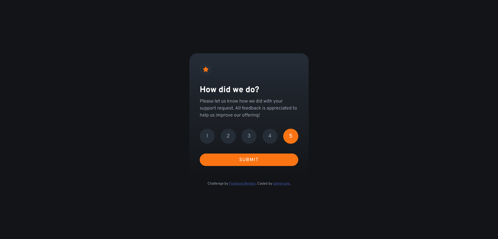
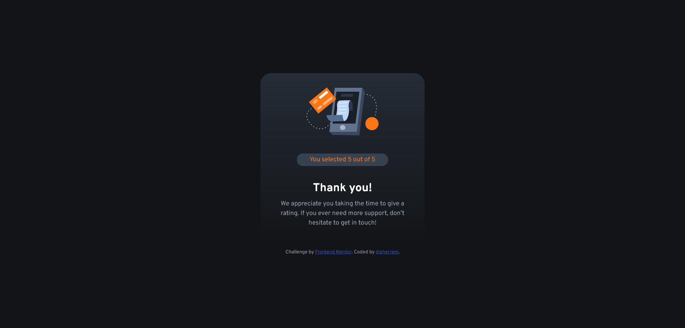

# Frontend Mentor - Solución del componente de clasificación interactivo 🌟

¡Hola a todos! 👋

Esta es mi solución para el [desafío del componente de clasificación interactivo en Frontend Mentor](https://www.frontendmentor.io/challenges/interactive-rating-component-koxpeBUmI). Los desafíos de Frontend Mentor me ayudan a mejorar mis habilidades de codificación al construir proyectos realistas.

## Visión General 👀

### El Desafío

Los usuarios deben poder:

- Ver el diseño óptimo de la aplicación según el tamaño de pantalla de su dispositivo.
- Ver estados de "hover" para todos los elementos interactivos en la página.
- Seleccionar y enviar una clasificación numérica.
- Ver el estado de "Gracias" después de enviar una clasificación.

## Capturas de Pantalla 🖼️

### Escritorio

### Enlaces 🔗

- [Ver Solución en GitHub Pages](https://dieherram.github.io/fem-interactive-rating-component/)

## Mi Proceso 🚀

### Construido con

- Marcado semántico HTML5
- Propiedades personalizadas de CSS
- Flexbox
- CSS Grid
- [JavaScript Vanilla](https://developer.mozilla.org/es/docs/Web/JavaScript)

### Lo que aprendí 🧠

Durante este proyecto, fortalecí mis habilidades en la manipulación del DOM usando JavaScript Vanilla. Algunas de las lecciones clave incluyen:

- Cómo seleccionar elementos del DOM utilizando `document.querySelector` y `document.querySelectorAll`.
- Agregar y eliminar clases para cambiar la apariencia de los elementos en respuesta a las interacciones del usuario.
- Usar eventos, como hacer clic en un elemento, para desencadenar funciones específicas, como cambiar la visibilidad de elementos en la página.
- Actualizar el contenido del DOM dinámicamente según las interacciones del usuario, en este caso, mostrando la calificación seleccionada.

### Desarrollo Continuo 🚧

En el futuro, planeo seguir mejorando mis habilidades en la manipulación del DOM y explorar técnicas más avanzadas para crear experiencias de usuario más dinámicas y atractivas.

### Recursos Útiles 🛠️

- [MDN Web Docs: Document Object Model (DOM)](https://developer.mozilla.org/es/docs/Web/API/Document_Object_Model) - Esta documentación me ayudó a entender mejor cómo trabajar con el DOM en JavaScript.

## Autor 👨‍💻

- GitHub: [@dieherram](https://github.com/dieherram)
- Frontend Mentor: [@dieherram](https://www.frontendmentor.io/profile/dieherram)
- Codewars: [@dieherram](https://www.codewars.com/users/dieherram)
- LinkedIn: [Diego Hernández Ramos](https://www.linkedin.com/in/diego-hernandez-ramos/)

## Reconocimientos 🙌

¡Gracias a Frontend Mentor por proporcionar desafíos y a la increíble comunidad de desarrolladores! 🌟
